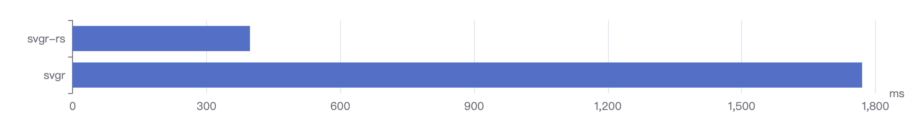

<h1 align="center">SVGR RS</h1>

<p align="center">SVGR rewritten in Rust 🦀</p>

> ⚠️ RVGR RS is in early development and should not be used in production, expect bugs! 🐛

# Node.js

Use SVGR RS in Node.js to complex transformations or tools.

## Install

```sh
npm install --save-dev @svgr-rs/core
# or use yarn
yarn add --dev @svgr-rs/core
```

## Usage

Import `transform` from `@svgr-rs/core` to transform a file. It takes three arguments:

* `source`: the SVG source code to transform
* `options`: the options used to transform the SVG
* `state`: a state linked to the transformation

```js
import { transform } from '@svgr-rs/core'

const svgCode = `
<svg xmlns="http://www.w3.org/2000/svg"
  xmlns:xlink="http://www.w3.org/1999/xlink">
  <rect x="10" y="10" height="100" width="100"
    style="stroke:#ff0000; fill: #0000ff"/>
</svg>
`

const jsCode = await transform(
  svgCode,
  { icon: true },
  { componentName: 'MyComponent' },
)
```

# Benchmarks

Transform time without SVGO and Prettier in W3C SVG 1.1 TestSuite:



# Roadmap

- [x] jsxRuntime
- [x] jsxRuntimeImport
- [x] icon
- [x] native
- [x] typescript
- [x] dimensions
- [x] expandProps
- [ ] prettier
- [ ] prettierConfig
- [ ] svgo
- [ ] svgoConfig
- [x] ref
- [x] memo
- [x] replaceAttrValues
- [x] svgProps
- [x] titleProp
- [x] descProp

# License

[MIT](./LICENSE)
